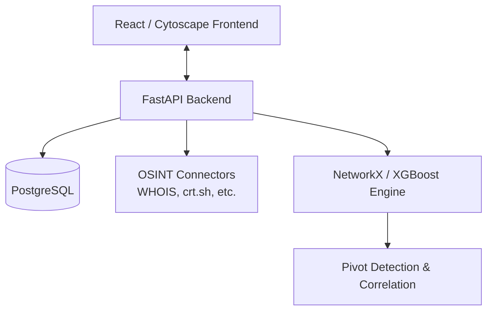

<div align="center">
  <h1>🌌 Orion</h1>
  <p><b>An OSINT link-analysis and suspect correlation engine built to assist investigative teams in mapping cybercrime networks.</b></p>
  
  [](https://opensource.org/licenses/MIT)
  [](https://orionerakshak.vercel.app/)
  
  **Live Demo:** [orionerakshak.vercel.app](https://orionerakshak.vercel.app/) • **Demo Video:** `[TODO: Add YouTube/Loom Link]`
</div>

---

## 🛑 The Problem
Cybercrime investigations often stall due to highly fragmented data. Evidence scattered across different domains—WHOIS records, certificate logs, data breaches, and social media footprints—is incredibly difficult to piece together manually. Investigative teams lack a unified, automated tool to cross-correlate disparate aliases, crypto wallets, domains, and phone numbers to reveal the hidden networks behind cybercrimes.

## 💡 The Solution
**Orion** is an intelligent, automated OSINT ingestion and correlation engine. It automatically normalizes raw suspect data, queries a wide array of external intelligence databases, detects hidden pivot points, and generates comprehensive evidentiary dossiers. By utilizing an XGBoost refinement layer over a NetworkX correlation engine, Orion empowers analysts to map complex criminal networks in a fraction of the time.

## ✨ Key Features

### 🖥️ Immersive Investigator UI
- **Cyberpunk Desktop Paradigm**: A window-based operating system UI tailored for complex multi-tasking investigations.
- **Interactive Graph Visualizations**: Cytoscape.js powered suspect correlation node map to visually explore entity relationships.
- **Geo-Intelligence Mapping**: 3D interactive globe visualizations (via React Globe) for spatial mapping of IP intelligence and suspect locations.
- **Temporal Event Timeline**: A chronological timeline view to track events, breaches, and suspect activities over time.
- **Cross-Correlation Window**: Advanced interface to cross-reference attributes across multiple distinct cases simultaneously.

### 🧠 Intelligence Engine & Machine Learning
- **Pluggable OSINT Connector Registry**: Concurrent asynchronous querying of external sources (WHOIS/RDAP, crt.sh, Web Archive CDX, WhatsMyName Username Enumeration, Face Similarity Matcher, Breach Data).
- **Auto-Type Detection & Sanitization**: Regex categorization and standardizing inputs (emails, phones, domains, wallets, images) automatically upon ingestion.
- **Link Correlation Engine**: NetworkX multi-directed graph engine mapping case-wide associations.
- **Fuzzy Disambiguation & XGBoost**: Uses `rapidfuzz` (Fellegi-Sunter baseline) and XGBoost classification to calculate dynamic edge confidence scores.
- **Automated Pivot Detection**: Automatically flags critical hub entities (nodes with 3+ connections) to highlight investigative pivot points.

### 🤖 Generative AI & Accessibility
- **Generative AI Case Narrative**: Built-in OSINT AI Assistant powered by Groq (LLaMA-3.3-70B) to synthesize evidence packs into conversational answers and dossier narratives.
- **Multilingual Text-to-Speech (TTS)**: Built-in Edge TTS engine reading out dossier intel in English, Hindi, and Gujarati.
- **Standalone Transliteration & i18n**: Dynamically transliterates native Indic scripts (Hindi, Gujarati) to Latin form for unified searching and suspect matching.
- **Guided AI Assistant & Tour**: Interactive onboarding led by 'LeoAvatar' to guide new investigators.
- **Real-Time Websocket Notifications**: Alert bell system for long-running background ingestion jobs.

### ⚖️ Evidentiary & Legal Reporting
- **Evidentiary Dossier Reports**: One-click generation of comprehensive case reports in JSON, CSV, and print-ready PDF formats.
- **Legal Offense Mapping**: Automatically maps findings to Indian IT Act and BNS sections based on extracted evidence.
- **Security & Auditing**: Local SQLite chain-of-custody logging system tracking all investigator actions, timestamps, and parameters.

## 🛠 Tech Stack
- **Frontend**: React 19, TypeScript, Vite, Tailwind CSS, Cytoscape.js, Framer Motion
- **Backend**: FastAPI, PostgreSQL (SQLAlchemy), XGBoost, NetworkX, Uvicorn, Celery
- **Cloud & External Services**: Render (Backend), Vercel (Frontend), Neon.tech (DB), Groq

## 🏗 Architecture Overview
Orion is built on a decoupled architecture for maximum scalability and modularity. 




## 🚀 Setup & Installation (Local Development)

### 1. Database & Environment
1. Clone this repository: `git clone https://github.com/YourOrg/Orion.git`
2. Set up a free PostgreSQL database (e.g., via [Neon.tech](https://neon.tech)).
3. Create a `.env` file in the `backend/` directory based on `backend/.env.example` and provide your `DATABASE_URL` and `GROQ_API_KEY`.

### 2. Backend (FastAPI)
```bash
cd backend
python -m venv venv
# Windows: venv\Scripts\activate | macOS/Linux: source venv/bin/activate
pip install -r requirements.txt
uvicorn app.main:app --reload --port 8000
```
*The API will be available at http://localhost:8000*

### 3. Frontend (React/Vite)
```bash
# In a new terminal
cd frontend
npm install
npm run dev
```
*The UI will be available at http://localhost:5173*

## 🐳 Docker Deployment
For a production-ready setup with isolated local AI and background task queues:
```bash
docker compose up --build
```

---

## ⚠️ Known Limitations
- **Graph State Synchronization**: Minor UI state synchronization delays may occur when toggling between highly complex correlation graphs rapidly. This is actively being refined.
- **Free Tier Rate Limits**: The live deployment uses free-tier APIs which may occasionally rate-limit bulk OSINT ingestion. 

## 👥 Team & Credits
**Hackathon:** ERakshak  
**Track:** PS_01: Advanced Multi-Platform OSINT (Open Source Intelligence) Intelligence Aggregator

- Nishchay Mittal
- Neel Mhaske
- Leon Lobo
- Shreya Ashar

## 📄 License
This project is licensed under the [MIT License](LICENSE).
