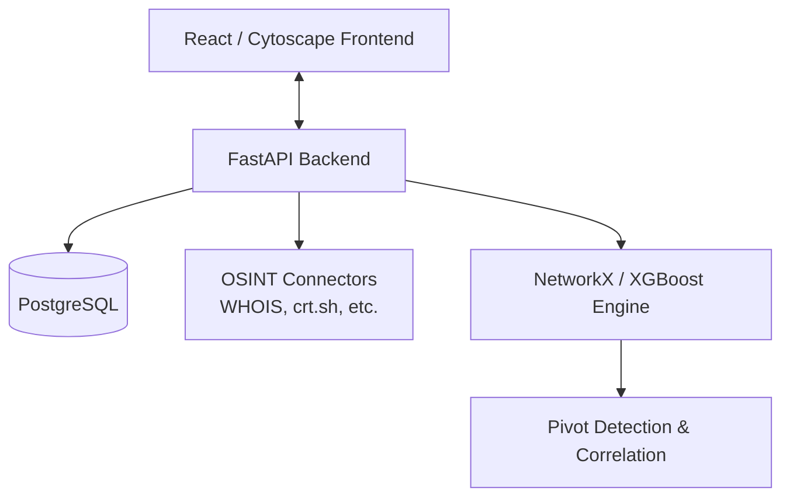

<div align="center">
  <h1>🌌 Orion</h1>
  <p><b>An OSINT link-analysis and suspect correlation engine built to assist investigative teams in mapping cybercrime networks.</b></p>
  
  [](https://opensource.org/licenses/MIT)
  [](https://orionerakshak.vercel.app/)
  
  **Live Demo:** [orionerakshak.vercel.app](https://orionerakshak.vercel.app/) • **Demo Video:** `[TODO: Add YouTube/Loom Link]`
</div>

---

## 🛑 The Problem
Cybercrime investigations often stall due to highly fragmented data. Evidence scattered across different domains—WHOIS records, certificate logs, data breaches, and social media footprints—is incredibly difficult to piece together manually. Investigative teams lack a unified, automated tool to cross-correlate disparate aliases, crypto wallets, domains, and phone numbers to reveal the hidden networks behind cybercrimes.

## 💡 The Solution
**Orion** is an intelligent, automated OSINT ingestion and correlation engine. It automatically normalizes raw suspect data, queries a wide array of external intelligence databases, detects hidden pivot points, and generates comprehensive evidentiary dossiers. By utilizing an XGBoost refinement layer over a NetworkX correlation engine, Orion empowers analysts to map complex criminal networks in a fraction of the time.

## ✨ Key Features
- **Pluggable OSINT Connectors**: Concurrent asynchronous querying of sources like WHOIS/RDAP, crt.sh, Web Archive CDX, and Breach Repositories.
- **Link Correlation Engine**: Maps case-wide associations and disambiguates suspects using a Fellegi-Sunter baseline matcher and an XGBoost refinement layer.
- **Interactive Visualizations**: A React-based UI powered by Cytoscape.js for deep-dive graph exploration of suspect relationships and SHAP feature confidences.
- **Evidentiary Dossier Reports**: One-click generation of comprehensive case reports in JSON, CSV, and PDF formats.
- **Standalone Transliteration**: Normalizes native text scripts to Latin form using a standalone phonetic engine for multilingual suspect matching.

## 🛠 Tech Stack
- **Frontend**: React 19, TypeScript, Vite, Tailwind CSS, Cytoscape.js, Framer Motion
- **Backend**: FastAPI, PostgreSQL (SQLAlchemy), XGBoost, NetworkX, Uvicorn, Celery
- **Cloud & External Services**: Render (Backend), Vercel (Frontend), Neon.tech (DB), Groq

## 🏗 Architecture Overview
Orion is built on a decoupled architecture for maximum scalability and modularity. 




## 🚀 Setup & Installation (Local Development)

### 1. Database & Environment
1. Clone this repository: `git clone https://github.com/YourOrg/Orion.git`
2. Set up a free PostgreSQL database (e.g., via [Neon.tech](https://neon.tech)).
3. Create a `.env` file in the `backend/` directory based on `backend/.env.example` and provide your `DATABASE_URL` and `GROQ_API_KEY`.

### 2. Backend (FastAPI)
```bash
cd backend
python -m venv venv
# Windows: venv\Scripts\activate | macOS/Linux: source venv/bin/activate
pip install -r requirements.txt
uvicorn app.main:app --reload --port 8000
```
*The API will be available at http://localhost:8000*

### 3. Frontend (React/Vite)
```bash
# In a new terminal
cd frontend
npm install
npm run dev
```
*The UI will be available at http://localhost:5173*

## 🐳 Docker Deployment
For a production-ready setup with isolated local AI and background task queues:
```bash
docker compose up --build
```

---

## ⚠️ Known Limitations
- **Graph State Synchronization**: Minor UI state synchronization delays may occur when toggling between highly complex correlation graphs rapidly. This is actively being refined.
- **Free Tier Rate Limits**: The live deployment uses free-tier APIs which may occasionally rate-limit bulk OSINT ingestion. 

## 👥 Team & Credits
**Hackathon:** ERakshak  
**Track:** PS_01: Advanced Multi-Platform OSINT (Open Source Intelligence) Intelligence Aggregator

- Nishchay Mittal
- Neel Mhaske
- Leon Lobo
- Shreya Ashar

## 📄 License
This project is licensed under the [MIT License](LICENSE).
