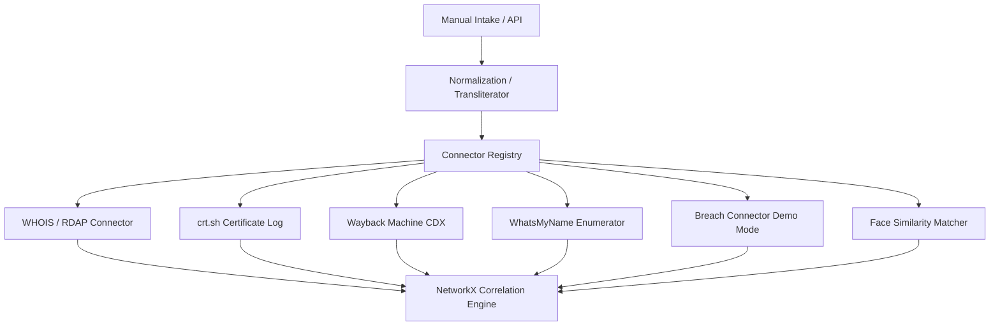

# e-Rakshak Architecture & System Documentation

e-Rakshak is an OSINT link-analysis and suspect correlation engine built to assist investigative teams in mapping cybercrime networks. The system automates ingestion, normalizes raw suspect data, queries external intelligence databases, detects pivots, and generates evidentiary dossier reports.

---

## 1. Pluggable Connector Architecture

The backend implements a modular, registry-based connector framework. All OSINT queries run concurrently through an asynchronous registry loop, preventing slow network endpoints from bottlenecking the system.

### Connector Registry List
1. **WHOIS/RDAP (`WhoisConnector`)**: Queries RDAP servers (e.g., `rdap.org`) to parse registrant organization details, contact emails, names, and event timestamps without API keys.
2. **Certificate Transparency (`CrtShConnector`)**: Pings `crt.sh` to extract certificate logs and identify active subdomains.
3. **Web Archive CDX (`WaybackConnector`)**: Fetches archival records from Wayback Machine CDX database to track domain history and historic URLs.
4. **Username Enumeration (`UsernameEnumConnector`)**: Queries a high-fidelity list of social/profile websites to check username availability and returns active profiles.
5. **Breach Repository (`BreachDemoConnector`)**: Runs against a pre-seeded local breach dataset linking leaked credentials, source domains, passwords, and IP addresses.
6. **Face Similarity (`FaceMatcherConnector`)**: Uses a pure-python grayscale pixel variance matching algorithm to compare facial headshots against a pre-seeded folder of target suspect profiles.

---

## 2. Ingestion & Normalization Pipe

To resolve entities correctly, all incoming seeds go through the normalization module before querying the registry:
* **Indic Romanization**: Translates native text scripts (Hindi, Gujarati, Hinglish) to normalized Latin form using `anyascii` to ensure names match across multilingual data.
* **Auto-Type Detection**: Utilizes regular expressions to dynamically categorize inputs (emails, phones, domains, crypto wallets, usernames, photos, names).
* **Sanitization**: Standardizes casing, removes whitespaces, strips URL protocol wrappers, and formats international phone numbers.

---

## 3. NetworkX Link Correlation Engine

Case-wide associations are mapped using a `networkx.MultiDiGraph`:
* **Node Types**: Seeds (emails, domains, etc.) are marked as input nodes; findings (subdomains, organizations, breach names, suspect names) are added as resolved nodes.
* **Edge Mapping**: Edges store the connector name, relationship label, and confidence score.
* **Suspect Disambiguation**: Uses `rapidfuzz` fuzzy string comparison to check registrant names. If a name has a similarity score $\ge 85\%$ against a known suspect, a high-confidence edge is created.
* **Pivot Detection**: Nodes with a connection degree $\ge 3$ are flagged as `"pivot": true`, triggering UI alerts to highlight key hub entities.

---

## 4. Evidentiary Dossier Reports

For evidentiary validation, e-Rakshak exposes three dossier formats:
* **JSON Export**: Provides the complete hierarchical representation of cases, identifiers, and connector findings.
* **CSV Export**: Flattens all findings into a structured table containing Node ID, Type, Connector Source, and Confidence score.
* **PDF Export**: Generates a professional, print-ready intelligence report using `reportlab`, complete with metadata header cards, suspect attributes, case notes, and source logs.

---

## 5. Security & Auditing

All actions taken by investigators are audited in a SQLite log system. The backend records:
* Creator ID & Case details.
* Specific actions (e.g., case initialization, identifier addition, connector runs).
* Ingestion parameters for evidence tracking.

---

## 6. Staging & Demo Mode Disclaimer

* **Breach Data**: To prevent ToS violations, privacy leaks, and financial costs during the prototype evaluation phase, the breach connector queries a **local seeded demo dataset** (`mock_breaches.json`).
* **Face Similarity**: Grayscale downscaling MSE is implemented as a pure-Python fallback. It handles offline environments and target systems without native C++ compilation headers (`cmake`, `dlib`) while maintaining valid similarity percentage scores.
